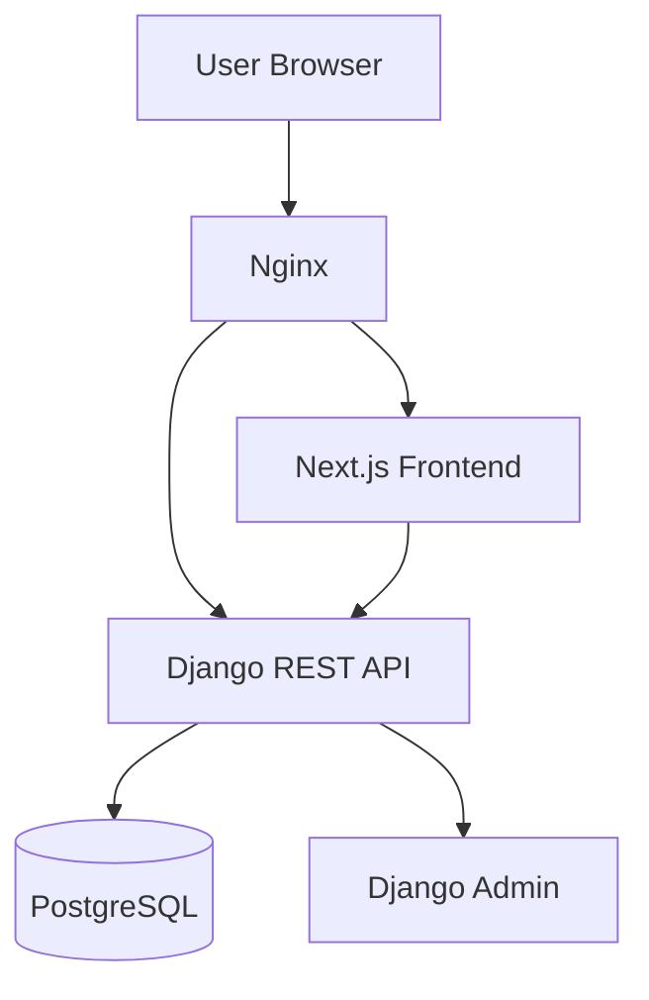

# MusicCoin Platform

MusicCoin is a full-stack music-event ticketing platform designed to provide secure event discovery, digital ticket reservation, QR-based admission and duplicate-entry prevention.

The current submission delivers a working event-ticketing MVP with JWT authentication, role-aware check-in security, PostgreSQL persistence, a Next.js user interface and deployment on AWS EC2.

## Live Demo

- Application: http://15.206.149.160/
- Events: http://15.206.149.160/events
- Tickets: http://15.206.149.160/tickets
- Gate scanner: http://15.206.149.160/scanner
- Django administration: http://15.206.149.160/admin/

> Camera access generally requires HTTPS. The gate scanner camera works on localhost. Manual ticket verification remains available on the HTTP deployment.

## Implemented Features

### Authentication

- User registration and login
- JWT access and refresh tokens
- Automatic access-token refresh
- Token blacklisting during logout
- Forgot-password and reset-password flow
- Protected frontend pages
- Custom email-based Django user model

### Events

- Public event listing
- Event detail pages
- Event search and city filtering
- Venue management
- Ticket-tier management
- Published, draft, cancelled and completed event states
- Event time-window validation
- Organizer and artist information
- Django admin event management

### Ticketing

- Authenticated ticket reservation
- Unique ticket UUID
- Secure verification hash
- User-specific “My Tickets” page
- Genuine QR code generation
- QR payload containing ticket verification credentials
- Purchase price and ticket-tier display
- Ticket status tracking

### Gate Check-In

- Camera-based QR scanning on secure origins or localhost
- Automatic QR payload parsing
- Manual ticket-entry fallback
- Organizer and administrator authorization
- Event start and end-time checks
- Invalid and cancelled ticket detection
- Duplicate check-in prevention
- Check-in timestamp recording
- Admission-granted and admission-denied responses

### User Interface

- Responsive Next.js interface
- MusicCoin visual identity
- Login and registration pages
- Events catalogue
- Event details
- User dashboard
- My Tickets
- Gate Scanner
- Marketplace demonstration page
- Staking demonstration page
- Shared navigation and footer

## Technology Stack

| Layer | Technology |
|---|---|
| Frontend | Next.js 15, React, TypeScript, Tailwind CSS |
| API client | Axios |
| QR generation | qrcode.react |
| QR scanning | html5-qrcode |
| Backend | Django 5, Django REST Framework |
| Authentication | Simple JWT |
| Database | PostgreSQL |
| API documentation | drf-spectacular |
| Production server | Gunicorn |
| Reverse proxy | Nginx |
| Hosting | AWS EC2 |
| Version control | Git and GitHub |

## Architecture



Nginx receives public HTTP requests and routes frontend requests to Next.js and API requests to Gunicorn/Django. Django stores users, events, ticket tiers, tickets and check-in records in PostgreSQL.

## Repository Structure

```text
musiccoin-platform/
├── backend/
│   ├── apps/
│   │   ├── artists/
│   │   ├── authentication/
│   │   ├── events/
│   │   ├── tickets/
│   │   └── users/
│   ├── config/
│   ├── manage.py
│   └── requirements.txt
├── frontend/
│   ├── public/
│   ├── src/
│   │   ├── app/
│   │   ├── components/
│   │   ├── context/
│   │   └── lib/
│   ├── package.json
│   └── tsconfig.json
└── README.md
```

## Core API Routes

| Method | Route | Purpose |
|---|---|---|
| POST | `/api/auth/register/` | Register a user |
| POST | `/api/auth/login/` | Obtain JWT tokens |
| POST | `/api/auth/refresh/` | Refresh an access token |
| POST | `/api/auth/logout/` | Blacklist a refresh token |
| POST | `/api/auth/forgot-password/` | Request password reset |
| POST | `/api/auth/reset-password/` | Complete password reset |
| GET | `/api/users/me/` | Get authenticated user |
| GET | `/api/events/` | List published events |
| GET | `/api/events/<slug>/` | Get event details |
| GET | `/api/tickets/my-tickets/` | List the current user’s tickets |
| POST | `/api/tickets/check-in/` | Verify and check in a ticket |

## Local Development

### Requirements

- Python 3.12 or newer
- Node.js 20 or newer
- PostgreSQL
- Git

### Backend Setup

```powershell
cd backend

python -m venv .venv
.\.venv\Scripts\Activate.ps1

pip install -r requirements.txt
```

Create `backend/.env`:

```env
SECRET_KEY=replace-with-a-private-django-secret
DEBUG=True
ALLOWED_HOSTS=127.0.0.1,localhost

DB_NAME=musiccoin_db
DB_USER=musiccoin_user
DB_PASSWORD=replace-with-your-database-password
DB_HOST=127.0.0.1
DB_PORT=5432

CORS_ALLOWED_ORIGINS=http://localhost:3000,http://127.0.0.1:3000
```

Apply migrations and start Django:

```powershell
python manage.py migrate
python manage.py check
python manage.py runserver
```

The API will run at:

```text
http://127.0.0.1:8000
```

### Frontend Setup

Open another terminal:

```powershell
cd frontend
npm install
```

Create `frontend/.env.local`:

```env
NEXT_PUBLIC_API_URL=http://127.0.0.1:8000/api
```

Start Next.js:

```powershell
npm run dev
```

Open:

```text
http://localhost:3000
```

## Testing

Run backend checks and automated tests:

```powershell
cd backend
.\.venv\Scripts\Activate.ps1

python manage.py check
python manage.py test apps.events apps.tickets
```

Run the frontend production build:

```powershell
cd frontend
npm run build
```

The current automated backend test suite verifies the core events and ticketing behavior. The frontend build performs linting and TypeScript validation.

## Demo Workflow

1. Open the Events page.
2. Select the published MusicCoin event.
3. Register or log in as a fan.
4. Reserve an available ticket tier.
5. Open My Tickets.
6. Display the generated ticket QR code.
7. Log in separately as the event organizer or administrator.
8. Open Gate Scanner.
9. Scan the fan’s QR code.
10. Select **Verify and check in**.
11. Confirm that admission is granted.
12. Scan the same ticket again to demonstrate duplicate-entry prevention.

## AWS Deployment

The deployed architecture uses:

- AWS EC2
- Ubuntu
- PostgreSQL
- Gunicorn
- systemd services
- Next.js production server
- Nginx reverse proxy

Production services:

```text
musiccoin-backend.service
musiccoin-frontend.service
nginx.service
```

Deployment health checks:

```bash
curl -I http://127.0.0.1/
curl -I http://127.0.0.1/api/events/
curl -I http://127.0.0.1/tickets
curl -I http://127.0.0.1/scanner
```

## Security Features

- Password hashing through Django authentication
- JWT-protected endpoints
- Refresh-token rotation and blacklisting
- Organizer-only ticket check-in
- Ticket verification hashes
- Event-time validation
- Duplicate-entry prevention
- Environment-based secrets
- PostgreSQL access credentials excluded from Git
- Production traffic routed through Nginx

## Current Scope and Limitations

The following items are presentation or future-scope modules and are not claimed as complete production integrations:

- Blockchain ticket minting
- Polygon smart-contract deployment
- NFT marketplace settlement
- Cryptocurrency payments
- On-chain royalty distribution
- Wallet transaction signing
- Real staking rewards
- Production email provider

Camera access on the public AWS IP is restricted by browser secure-context rules because the current deployment uses HTTP. HTTPS and a domain should be configured before production use.

## Future Development

- Domain and HTTPS configuration
- Polygon smart-contract integration
- NFT ticket minting
- Wallet-based authentication
- Payment-gateway integration
- Secondary ticket marketplace
- Automated royalty distribution
- Real staking contracts
- Organizer analytics dashboard
- Expanded automated test coverage
- CI/CD deployment workflow
- Production email delivery
- Monitoring and centralized logging

## Author

**Isra Munshi**  
B.Tech Information Technology  
Indus University, Ahmedabad

## Disclaimer

MusicCoin is currently an academic MVP. Blockchain, financial and marketplace modules shown in the interface are future-scope demonstrations unless explicitly listed as implemented above.